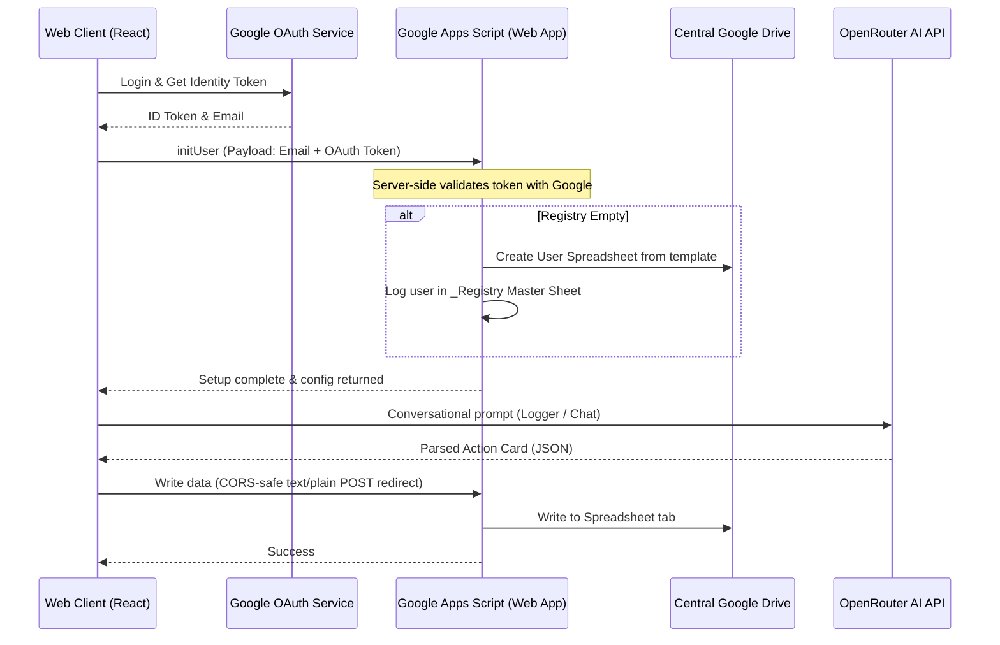

# Financial OS (v4) 🚀

Financial OS is a premium, high-performance, neon-accented, glassmorphic personal finance dashboard and AI assistant. It integrates a **React SPA frontend** with a **Google Apps Script backend** (using Google Sheets as a serverless database), powered by **OpenRouter AI models** for intelligent transaction logging, dynamic data processing, and proactive financial coaching.

---

## 🏗️ Architecture & Data Flow



### Key Architectural Highlights
1. **Registry-Directory Model**: Individual spreadsheet databases are auto-provisioned securely in a dedicated Google Drive folder (`Financial OS User Sheets`) for each user. A master `_Registry` spreadsheet holds the user directory and control records.
2. **Server-Side Token Verification**: The Google Apps Script backend validates user identity by hitting `https://oauth2.googleapis.com/tokeninfo` directly using the user's OAuth access token. It ensures that the client requesting database operations matches the logged-in email.
3. **CORS-Safe Redirects**: Google Apps Script returns a `302 Moved Temporarily` HTTP redirect to a temporary HTML hosting site on final output. The React client-side bypasses browser CORS locks by sending requests as `text/plain` and using `redirect: 'follow'`.
4. **Local-First with Background Sync Polling**: Data is held in client context for instantaneous UI updates. A background worker polls the Apps Script backend every 15 seconds. If the sheet's `lastUpdated` timestamp in Google Drive is newer than the local copy, the dashboard silently pulls down the changes to sync.

---

## 🌟 Core Features

- **📊 Dynamic Dashboard**: High-fidelity financial charts (powered by Recharts) showcasing monthly income vs. expenses, category breakdown, budget burn rates, investment growth, and upcoming bills.
- **🤖 Conversation-First AI Logger**: Log expenses, incomes, or savings goal additions in natural language (e.g., *"spent 450 rupees on dinner at cafe yesterday"*). Features duplicate entry detection, edit validation cards, and instant delete capabilities.
- **🛠️ Self-Expanding Sheets Tab Creator**: Create completely new dashboard sections on the fly. The AI generates custom Google Sheet schemas, provisions tabs, and registers the component on your dashboard automatically.
- **🧠 Persistent AI Memory Engine**: The assistant extracts user preference details (like career profiles, favorite categories, and savings habits) during chat sessions and persists them to Google Sheets to provide tailored long-term recommendations.
- **🎨 Dynamic Theming & Vibes**: Choose from premium styled presets (Cyberpunk, Slate/Freelancer, Chalkboard/Teacher, Sakura, Minimalist) or type a vibe in plain text (e.g. *"futuristic space cockpit"*) and let the AI generate customized CSS variables to theme the interface.
- **🔒 Admin Control Panel**: A dedicated administrative dashboard (`/admin`) displaying platform KPIs (Total Users, Active, Suspended), a search filter, spreadsheet links, and status toggles (Active vs. Suspended).

---

## 🛠️ Technology Stack

- **Frontend**: React (v18), React Router Dom (v6), Recharts, Lucide React, Inline styling.
- **Backend & Database**: Google Apps Script (GAS), Google Sheets, Google Drive API.
- **Authentication**: Google Identity Services SDK (Google Client ID).
- **AI Engine**: OpenRouter API with fallbacks (`meta-llama/llama-3.1-8b-instruct:free`, `google/gemma-2-9b-it:free`, `qwen/qwen-2.5-7b-instruct:free`).

---

## 🚀 Deployment & Installation

### Step 1: Deploy the Google Apps Script Backend
1. Open [Google Sheets](https://sheets.google.com).
2. Create a new Spreadsheet to act as your **Master Sheet** (which will hold the `_Registry` user configurations). Copy the Sheet ID from the URL.
3. Go to [Google Apps Script](https://script.google.com) and create a new project.
4. Copy the entire contents of [Code.gs](file:///apps-script/Code.gs) into your script file.
5. In the Apps Script Project Settings:
   - Add a Script Property: Name: `MASTER_SHEET_ID`, Value: *Your master sheet ID*.
   - Add a Script Property: Name: `ADMIN_EMAIL`, Value: *Your email address (to grant `/admin` dashboard permissions)*.
   - Add a Script Property: Name: `GOOGLE_CLIENT_ID`, Value: *Your Google OAuth Client ID*.
   - Add a Script Property: Name: `OPENROUTER_API_KEY`, Value: *Your OpenRouter API Key*.
6. Click **Deploy** -> **New Deployment**:
   - **Select type**: Web App.
   - **Execute as**: `Me (your-email@gmail.com)`.
   - **Who has access**: `Anyone` *(Crucial: Selecting "Anyone with Google account" will break the React client CORS redirect flow).*
7. Copy the generated **Web App URL**.

---

### Step 2: Setup the Frontend Project
1. Clone this repository to your local system.
2. In the root directory, create a `.env` file containing:
   ```env
   REACT_APP_GOOGLE_CLIENT_ID=your-google-oauth-client-id
   REACT_APP_PROXY_URL=your-apps-script-web-app-url
   REACT_APP_OPENROUTER_API_KEY=your-openrouter-key
   ```
3. Update [src/config.js](file:///src/config.js) with your parameters as needed.

---

### Step 3: Local Run & Build
1. Install dependencies:
   ```bash
   npm install
   ```
2. Start the local development server:
   ```bash
   npm start
   ```
3. Generate the production build:
   ```bash
   npm run build
   ```

---

## 🔒 Security Best Practices
- **Scope Minimization**: The client app only requests `email profile` scopes. It never asks for broad read/write access to the user's entire Google Drive.
- **Server-Owned Execution**: All spreadsheet provisioning and Google Drive actions run strictly inside the backend Apps Script environment using the Admin's service context, separating the user interface permissions cleanly from database manipulation.
- **Local Secret Storage**: Local configurations, JWT tokens, and user profiles are stored in encrypted browser local storage and verified dynamically on page refreshes.